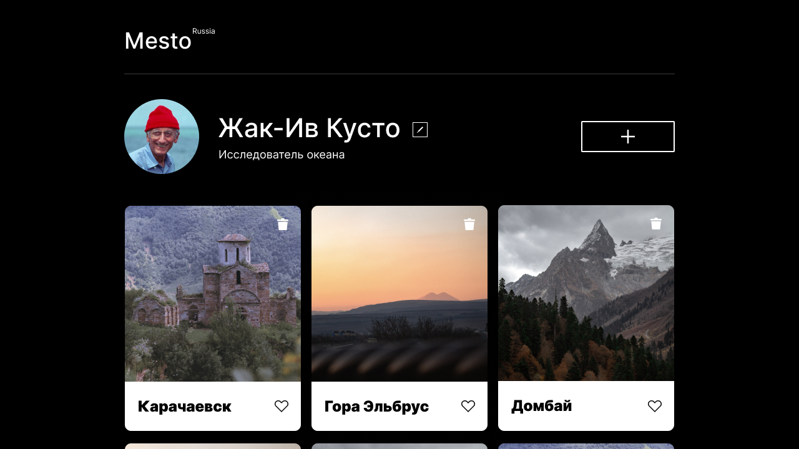

# Сервис [Mesto](https://ivanovanatalya.github.io/mesto)
---
**Проектная работа 9**

Выполнена в рамках обучения на курсе [веб-разработчик Яндекс.Практикум](https://practicum.yandex.ru/web/?utm_source=practicum&utm_medium=email&utm_campaign=sendr-597315).

  

* применена файловая структура проекта по правилам Nested БЭМ
* проработана адаптивная вёрстка
* применена работа с ветками в git
* добавлена работа с массивом карточек
* добавлены формы ввода
* добавлена возможность лайка и удаления карточек, открытия модальных окон
* добавлена валидация всех форм
* улучшена UX при работе с попапами
* применена работа с модулями в JavaScript
* добавлен Webpack
* добавлено подключение к   серверу

**Figma**
* [Макет в Figma](https://www.figma.com/file/2cn9N9jSkmxD84oJik7xL7/JavaScript.-Sprint-4?node-id=0%3A1)

**Планы по доработкам проекта:**
* рефакторинг кода (с учетом ревью)
